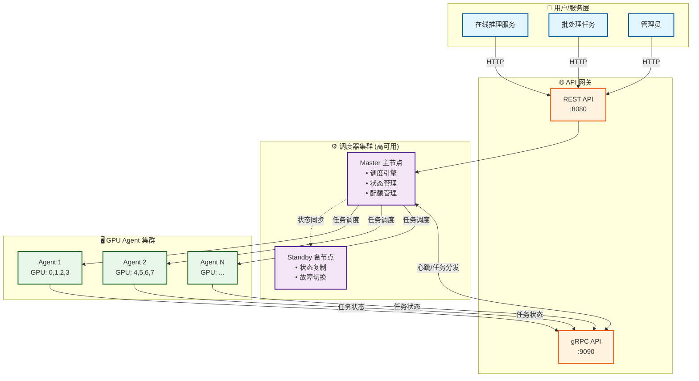
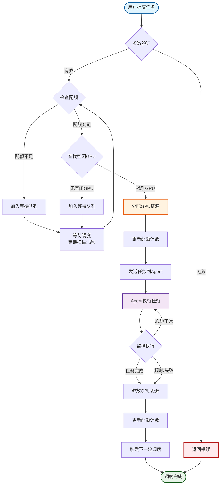
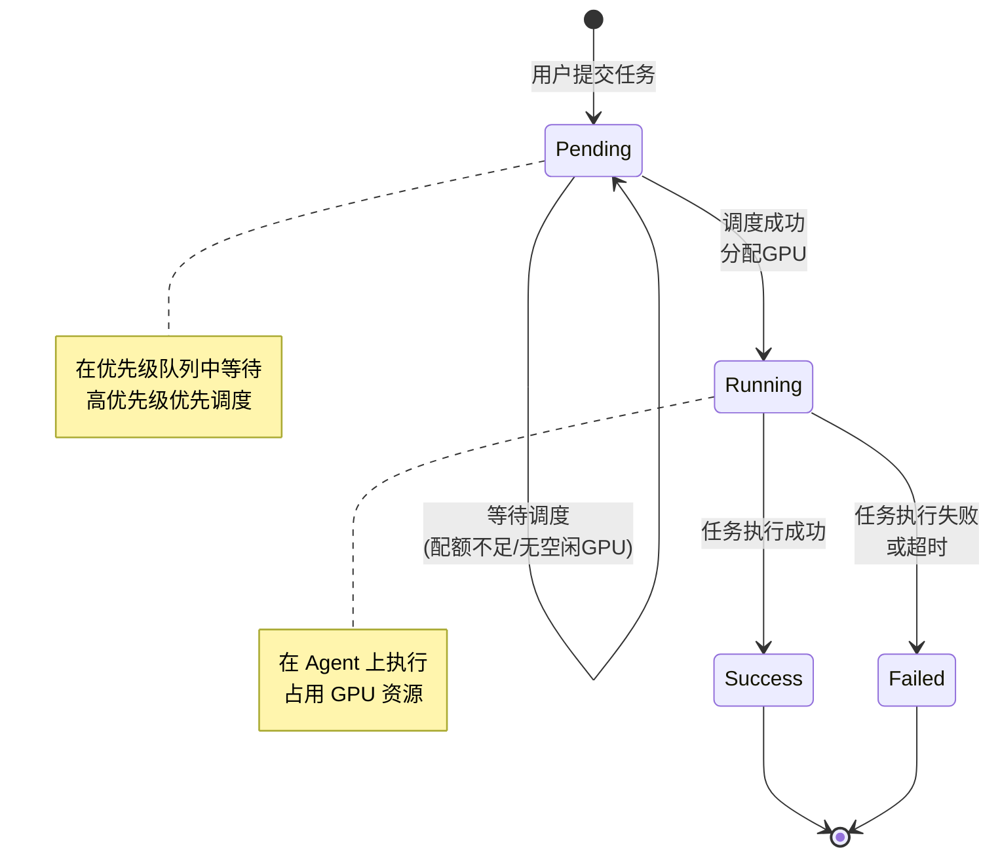

# DGPU 调度器 (DGPU Scheduler)

<div align="center">

[](https://golang.org/)
[](LICENSE)
[]()

**高性能的分布式 GPU 调度系统**

支持混合工作负载 • 资源配额管理 • 高可用架构

[English](README.md) | 简体中文

</div>

---

## 📖 项目简介

DGPU Scheduler 是为中型 GPU 集群（50-200 节点）设计的分布式调度系统，提供高效、可靠的 GPU 资源管理能力。

### ✨ 核心特性

- **🎯 混合工作负载**：支持在线推理服务与批处理任务的资源隔离
- **🔒 严格配额管理**：可配置的在线/离线资源分配比例，防止资源抢占
- **⚡ 高可用架构**：主备调度器自动故障切换，Agent 自动重连
- **🌐 双重 API**：gRPC（Agent 内部通信）+ HTTP REST（用户接口）
- **💪 零外部依赖**：无需 Redis/etcd，内存状态管理，本地持久化快照

### 🚀 性能指标

| 指标 | 实测值 | 说明 |
|------|--------|------|
| 调度延迟 | **4-17 微秒** | 微秒级响应，接近无感调度 |
| GPU 分配 | **<100 微秒** | 极速资源分配 |
| 设计吞吐量 | **1000 任务/秒** | 适合中型集群规模 |
| 集群规模 | **50-200 GPU 节点** | 中型集群优化 |
| 算法复杂度 | **O(n)** | n = GPU 总数，高效简洁 |

---

## 🏗️ 系统架构



**架构亮点**：
- **三层设计**：API 网关 → 调度主控 → 分布式 Agent
- **主备复制**：基于 Protobuf 的状态同步，自动故障转移
- **内存状态**：全内存状态管理 + 定期快照持久化（30秒）
- **智能调度**：FIFO + 优先级队列，配额感知调度

详细架构设计请参考：[系统设计文档](docs/plans/2025-12-14-dgpu-scheduler-design.md)

---

## 🚀 快速开始

### 环境准备

- **Go**: 1.19 或更高版本
- **Protocol Buffers**: protoc 编译器
- **NVIDIA GPU**: 带 CUDA 支持（用于 Agent 节点）

### 构建项目

```bash
# 克隆仓库
git clone https://github.com/chicogong/dgpu-scheduler.git
cd dgpu-scheduler

# 安装依赖
make deps

# 生成 Protobuf 代码
make proto

# 构建二进制文件
make build
```

构建完成后，可执行文件位于 `bin/` 目录：
- `bin/scheduler` - 调度器主节点
- `bin/agent` - GPU 节点 Agent

### 启动调度器

```bash
# 编辑配置文件
vim configs/scheduler.yaml

# 启动调度器主节点
./bin/scheduler -config configs/scheduler.yaml
```

**关键配置项**：
- `scheduler.role`: "master" 或 "standby"（主备角色）
- `quota.online_percent`: 在线服务 GPU 占比（默认 0.7）
- `quota.batch_percent`: 批处理任务 GPU 占比（默认 0.3）

### 启动 Agent

```bash
# 编辑配置文件
vim configs/agent.yaml

# 在 GPU 节点上启动 Agent
./bin/agent -config configs/agent.yaml
```

**关键配置项**：
- `gpu.detection_method`: "nvml" 或 "nvidia-smi"（GPU 检测方式）
- `executor.execution_method`: "docker" 或 "process"（任务执行方式）
- `scheduler.master_address`: 主调度器地址

---

## 📁 项目结构

```
dgpu-scheduler/
├── cmd/                     # 应用程序入口
│   ├── scheduler/          # 调度器主程序
│   └── agent/              # Agent 程序
├── pkg/                    # 核心包
│   ├── scheduler/          # 调度逻辑
│   │   ├── engine.go       # 调度引擎（核心算法）
│   │   └── state.go        # 状态管理器
│   ├── agent/              # Agent 逻辑
│   │   ├── gpu.go          # GPU 检测
│   │   ├── executor.go     # 任务执行
│   │   └── client.go       # gRPC 客户端
│   ├── api/                # API 网关
│   │   ├── grpc_server.go  # gRPC 服务
│   │   └── rest_server.go  # HTTP REST 服务
│   ├── models/             # 数据模型
│   │   └── types.go        # 核心类型定义
│   ├── config/             # 配置管理
│   └── logger/             # 日志系统
├── api/proto/              # Protobuf 定义
│   └── scheduler.proto     # 协议定义
├── configs/                # 配置模板
│   ├── scheduler.yaml      # 调度器配置
│   └── agent.yaml          # Agent 配置
├── docs/                   # 文档
│   └── plans/              # 设计文档
├── test-local/             # 本地测试环境
└── deployments/            # 部署文件
```

---

## 🎮 API 使用

### REST API（默认端口 8080）

#### 提交任务

```bash
curl -X POST http://localhost:8080/api/v1/tasks \
  -H "Content-Type: application/json" \
  -d '{
    "priority": "high",
    "gpu_count": 2,
    "command": "python train.py --epochs 100"
  }'
```

**响应示例**：
```json
{
  "task_id": "task-1765705835602527000",
  "status": "pending",
  "created_at": "2025-12-15T17:50:35.602529Z"
}
```

#### 查询任务状态

```bash
curl http://localhost:8080/api/v1/tasks/{task_id}
```

**响应示例**：
```json
{
  "task_id": "task-1765705835602527000",
  "status": "running",
  "priority": "high",
  "gpu_count": 2,
  "allocated_gpus": ["GPU-0", "GPU-1"],
  "started_at": "2025-12-15T17:50:35.602546Z"
}
```

#### 查询 GPU 资源

```bash
curl http://localhost:8080/api/v1/gpus
```

#### 查询配额状态

```bash
curl http://localhost:8080/api/v1/quota
```

完整 API 参考：[设计文档 - API 接口](docs/plans/2025-12-14-dgpu-scheduler-design.md#8-api接口设计)

---

## 🧪 开发与测试

### 运行测试

```bash
# 运行所有测试
make test

# 生成覆盖率报告
make test-coverage

# 测试特定包
go test -v ./pkg/scheduler/...
go test -v ./pkg/agent/...
```

### 代码质量

```bash
# 格式化代码
make fmt

# 运行代码检查
make lint
```

### 本地开发

项目提供了 `test-local/` 目录用于本地开发测试：

```bash
# 使用本地配置启动调度器
./bin/scheduler -config test-local/scheduler.yaml

# 使用本地配置启动 Agent（支持模拟 GPU）
./bin/agent -config test-local/agent.yaml
```

**模拟 GPU 环境**：`test-local/fake-nvidia-smi.sh` 提供了 4 个虚拟 V100 GPU 供开发测试使用。

---

## 📦 部署

### Docker 部署

```bash
# 构建 Docker 镜像
make docker-build

# 使用 Docker Compose 启动
docker-compose up -d
```

### Kubernetes 部署

```bash
# 应用 Kubernetes 配置
kubectl apply -f deployments/k8s/
```

---

## 📊 核心概念

### 调度流程



### 任务优先级

- **high（高优先级）**：在线推理服务，占用在线配额
- **low（低优先级）**：批处理任务，占用批处理配额

### 资源配额

系统通过配额机制防止在线/离线任务相互抢占资源：

```yaml
quota:
  online_percent: 0.7   # 70% GPU 分配给在线服务
  batch_percent: 0.3    # 30% GPU 分配给批处理任务
```

### GPU 状态

- **idle（空闲）**：可分配给新任务
- **busy（繁忙）**：正在运行任务
- **offline（离线）**：Agent 失联或 GPU 故障

### 任务生命周期



---

## 🔧 故障处理

### Agent 故障

- **检测机制**：心跳超时检测（默认 15 秒）
- **自动处理**：释放故障 Agent 的所有 GPU，重新调度任务
- **恢复流程**：Agent 重启后自动重连并注册

### 调度器故障

- **主备切换**：Standby 检测 Master 故障后自动晋升
- **状态恢复**：从本地快照恢复全局状态
- **Agent 重连**：Agent 自动切换到新 Master（指数退避重连）

### 状态持久化

- **快照周期**：每 30 秒自动保存状态快照
- **存储位置**：`snapshot_dir`（默认 `/var/lib/dgpu-scheduler/state`）
- **格式**：JSON（人类可读）

---

## 📈 监控与日志

### 结构化日志

系统使用 zap 库输出结构化日志（支持 JSON/Text 格式）：

**关键事件**：
- `task_submitted` - 任务提交
- `task_scheduled` - 任务调度成功
- `task_finished` - 任务完成
- `agent_registered` - Agent 注册
- `agent_offline` - Agent 离线

**性能日志**：
- HTTP 请求耗时：`pkg/api/rest_server.go:311-318`
- 任务生命周期时间：CreatedAt → StartedAt → FinishedAt

### 指标收集（规划中）

未来版本将支持 Prometheus 指标暴露：
- `task_submitted_total` - 任务提交总数
- `task_scheduled_total` - 任务调度总数
- `gpu_utilization{gpu_id}` - GPU 利用率
- `quota_online_used` - 在线配额使用量
- `agent_count{status}` - Agent 数量统计

---

## 🗺️ 开发路线图

- [x] 系统设计文档
- [x] 项目结构搭建
- [x] 核心调度模块（第一阶段）
- [x] API 通信层（gRPC + REST）
- [x] 任务执行器与集成测试
- [ ] 高可用功能（主备复制、故障切换）
- [ ] 监控与可观测性（Prometheus 集成）
- [ ] 自动扩缩容支持（未来）

---

## 🤝 贡献指南

欢迎贡献！在提交 PR 之前，请：

1. Fork 本仓库
2. 创建功能分支（`git checkout -b feature/AmazingFeature`）
3. 提交变更（`git commit -m 'Add some AmazingFeature'`）
4. 推送到分支（`git push origin feature/AmazingFeature`）
5. 开启 Pull Request

**开发规范**：
- 运行 `make fmt` 格式化代码
- 运行 `make lint` 进行代码检查
- 确保所有测试通过 `make test`
- 更新相关文档

---

## 📄 许可证

本项目基于 MIT 许可证开源 - 查看 [LICENSE](LICENSE) 文件了解详情。

---

## 📚 相关文档

- [系统设计文档](docs/plans/2025-12-14-dgpu-scheduler-design.md)（中文）
- [项目开发指南](CLAUDE.md)
- [英文 README](README.md)

---

## 🙏 致谢

感谢所有为 DGPU Scheduler 项目做出贡献的开发者！

---

<div align="center">

**⭐ 如果这个项目对你有帮助，欢迎 Star！⭐**

[报告问题](https://github.com/chicogong/dgpu-scheduler/issues) • [功能请求](https://github.com/chicogong/dgpu-scheduler/issues)

</div>
